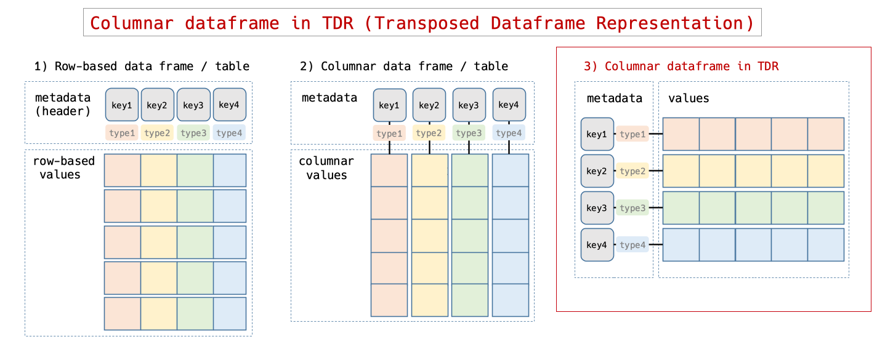

# TDR (Transposed DataFrame Representation)

([英語版](tdr.md) もあります)

TDR は、２次元のデータの表現方法につけた名前です。TDR では下の図のように同じ型のデータに key というラベルをつけて横に並べ、それらを縦に積み重ねてデータを表現します。

 

Arrow Columnar Format では、csv のような従来の行指向データ(1)に対して、列方向に連続したデータ(2)を取り扱います。この行、列という言葉は私たちの脳内イメージを規定していて、データフレームの構造といえば(1)または(2)のような形を思い浮かべることでしょう。しかし、本質は連続したデータの配置にあるので、我々の頭の中では(3)のように行と列を入れ替えて考えてもいいはずです。

大事なことは、TDR は頭の中の論理的なイメージであって、実装上のアーキテクチャではないということです。

TDR は、整然データ(tidy data)の考え方とも矛盾しません。TDR における整然データは行と列を入れ替えた形で全く同じデータを表しています。一つだけ気をつけることは、混乱を避けるため、位置や方向に関するワードである行(row)や列(column)を避けるべきであるということです。

TDR は、現時点でも2次元データを楽に初期化できる記法で、ごく自然に使われています。例えば、Red Arrow ではArrow::Table を初期化する際に下の図の右のように書けます。

これはごく自然な書き方ですが、この形は TDR の形と一致しています。その他の例として:
  - Ruby: Daru::DataFrame, Rover::DataFrame でも上と同じように書けます。
  - Python: Pandas で pd.DataFrame(data_in_dict) のように dict を使う場合が同じです。
  - R: tidyr で tibble(x = 1:3, y = c("A", "B", "C")) のように書けます。

それぞれのライブラリーで、データフレームを初期化するやり方はこれだけではありませんが、他の方法は少し回りくどいような印象があります。

TDR で考えた方がちょっぴりうまくいくというのは単なる仮説ですが、その理由は「この惑星では横書きでコードを書く」からではないかと私は考えています。

## Table and TDR API

TDR に基づいた API はまだ暫定板の段階であり、RedAmber は TDR の実験の場であると考えています。下記の表に TDR と行x列形式の Table のAPIの比較を示します（暫定版）。

|     |従来の Table|Transposed DataFrame|TDRに対するコメント|
|-----------|---------|------------|---|
|TDRでの呼称|`Table`|`TDR`|**T**ransposed **D**ataFrame **R**epresentationの略|
|変数 |列に配置|`variables` key と `Vector` として横方向に配置|key で選択|
|観測 |行に配置|`observations` 縦方向に切った一つ一つは`slice`|index や `slice` メソッドで選択|
|行の数|nrow, n_rows など |`size` |`n_row` をエイリアスとして設定|
|列の数|ncol, n_columns など |`n_keys`  |`n_col` をエイリアスとして設定|
|shape      |[nrow, ncol]  |`[size, n_keys]` |行, 列の順番は同じ|
|merge/join left| left_join(a,b) merge(a, b, how='left')|`a.join(b)` |自然に下にくっつける|
|merge/join right| right_join(a,b)) merge(a, b, how='right')|`b.join(a)` |自然に下にくっつける|

## Operation example with TDR API

[TDR の操作例](TDR_operation.pdf) (暫定版)

## Q and A for TDR

（作成中)
